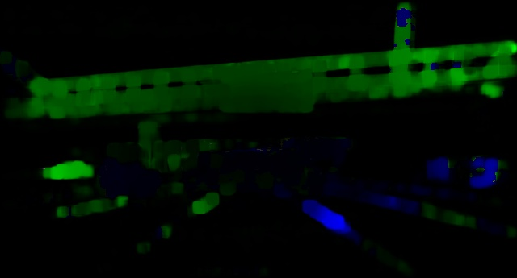
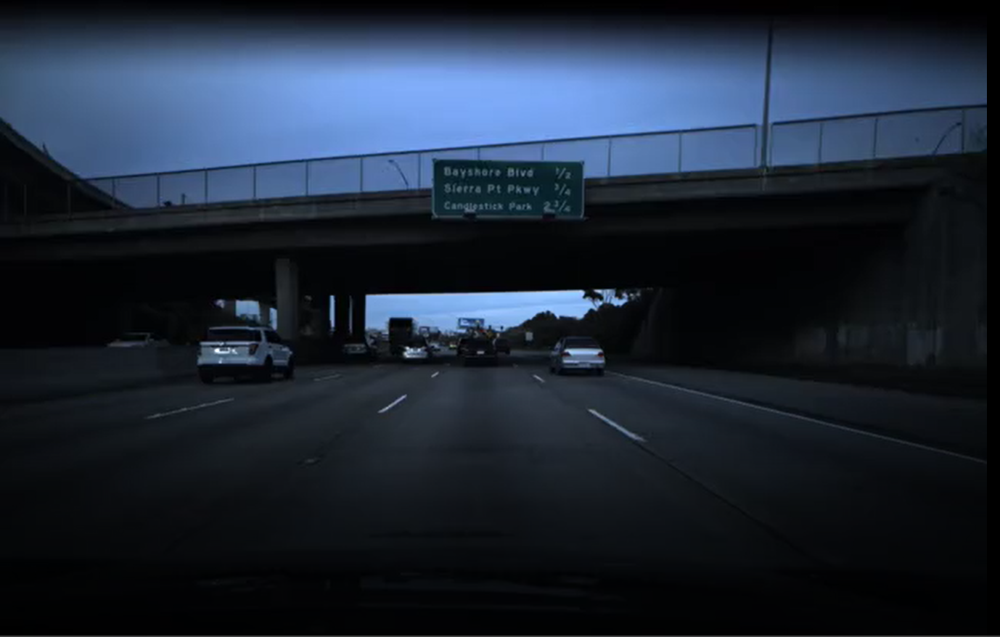
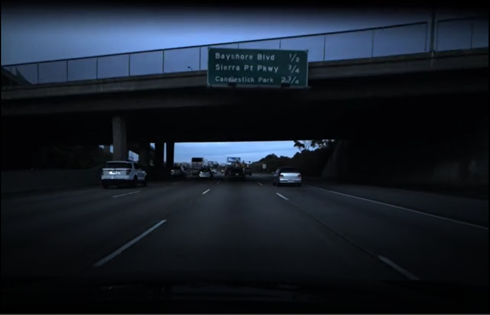
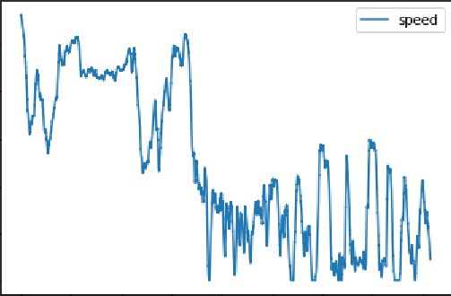

# Speed-Prediction-for-Cars-Dashcam-video-
Speed Prediction for Cars (Comma.ai Programming Challenge) 

## Project Description
This project aims to use a dashcam video of a car to predict the speed at which the car is moving. This project was done as a programming challenge for autonomous driving startup, Comma.ai.

## Research Findings
After doing some research, it seemed that it is essential to capture temporal features instead of just spatial features. One reliable way to do so is to generate optical flow images. An optical flow image is generated by comparing 2 images in consecutive timeframes (t, t+1), and highlighting the relative motion between the 2 frames.

There are 2 kinds of optical flow images: Sparse and Dense. Dense optical flow images consider every single pixel of the 2 frames, and generates a flow vector for each pixel. Dense optical flow is also thought of to be more accurate, so I decided to generate dense optical flow images.

|Optical flow image (from frame 0 and 1)|Frame0| Frame1 |
|---|---|--|
 ||

## Methodology
The following is a very brief description of the steps I took to complete the project, as well as the files that was used to complete each step.

- Extract video frames from training data set (frame_extraction.py)
- Analyse training data and identify data distribution (speed_data_analysis.py)
- Preprocess video frames(change brightness and crop image) (train.py)
- Generate optical flow images from video frames, using Farneback algorithm (train.py)
- Train CNN model using train_batch_generator (train.py)
- Save the weights of the model (train.py)

- Generate opticl flow images of test data (predict.py)
- Do prediction on test data (predict.py)

## Analyses and areas of improvement
The 2 challenges that I faced during this project was 1) Time Constraint and 2) Computational Resource constraint. Because of these constraints, there were a lot of improvements that I was not able to implement. I will, however, include these areas for improvements in this section. I would also like to point out that because of these constraints, the actual code written is sub-optimal, but it serves as a good structure or workflow. It can serve as good reference for anyone who wants to take on similar projects. 

### 1. Data poorly distributed
The data distribution is skewed. There were very few data in the middle ranges and the bottom ranges (where speed =0). 

One way to circumvent this could be to do some form of data gereation for data in these regions.

### 2. Vast difference in training and test data
One example will be the data points for speed=0 in both the training and test data. In the training data, the car reached speed=0 in the middle of traffic, so all surrounding objects were also stationary. As such, the optical flow images generated picked out almost no 'relative motions' between frames. On the other hand, in the test data set, the car reached speed=0 when it was parked on the roadside. As such, the optical images algorithm picked up 'relative motion' of cars moving in front of it, and the optical images had 'relative motions' features generated. This difference could have created a model that cannot accurately identify when the car is motionless (speed=0). 

One possible way to alleviate this might be to do some sort of data augmentation, to create more variance in the training data. More research has to be done on this to identify the best solution.

### 3. Smoothening prediction results
This methodology uses 2 video frames to product 1 optical flow image, and use 1 optical flow image to predict the speed of the car at that point of time. This could mean that 2 successive optical flow images (that are 0.05 seconds apart) could pick out 2 very different sets of features and thus predict 2 very different speeds. This is of course very unlikely, because the 2 optical flow images are less than 1 second apart, and their speeds should be similar.

One possible way to circumvent this is to use some sort of sliding window, to generate an unevenly-weighted average value. For example, let's say that I was trying to predict the speed of the car at time = t. Let p_speed(x) be the model's prediction of the speed at time = x. In order to find the speed of the car at time=t, i should use a combination of values, eg. A**x**p_speed(t) **+** B**x**p_speed(t-1) **+** C**x**p_speed(t-2) ... Where A>B>C etc. This will account for temporal feautures across a larger timeframe, as well as smoothen the ouputed results.

## Conclusion
Given the time and resource constraints, I was unable to implement this project to an optimal level. However, I did learn a lot of newknowledge and skills from this project. I learnt about the different toold in OpenCv, difficulties in image generation/detection, as well as the intricacies in time-series data analysis.
